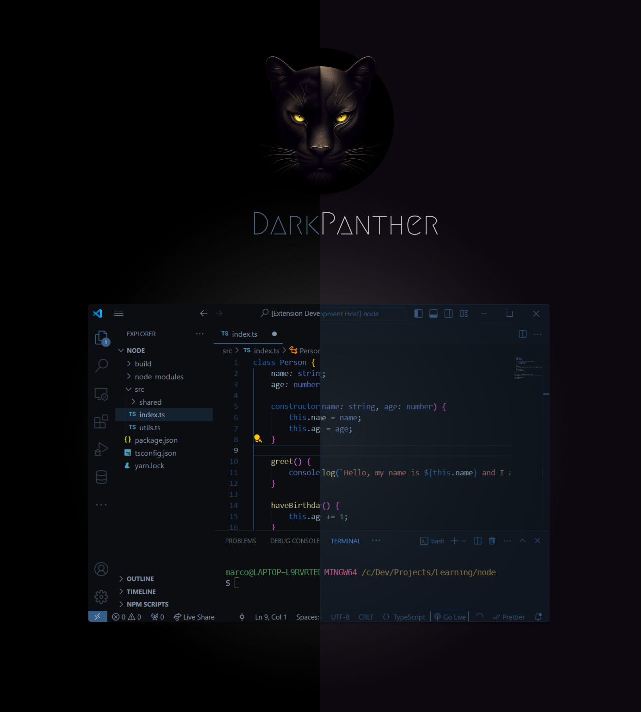

## Easy Installation

1. Open the extensions sidebar on Visual Studio Code
2. Search for **Dark Panther**
3. Click **Install** to install it.
4. Click **Reload** to reload your editor.
5. Code/File ＞ Preferences ＞ Color Theme ＞ **Dark Panther**.

VSCode Extension: [Dark Panther](https://marketplace.visualstudio.com/items?itemName=marcos-gomes-neto.dark-panther)

## License

[MIT](https://github.com/marcosgomesneto/dark-panther/blob/main/LICENSE.md)

